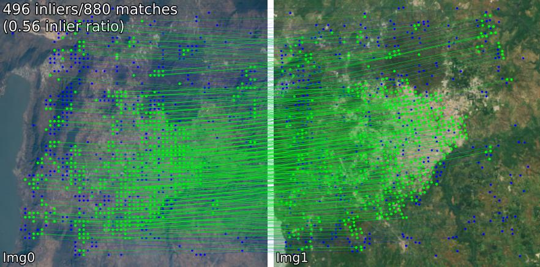
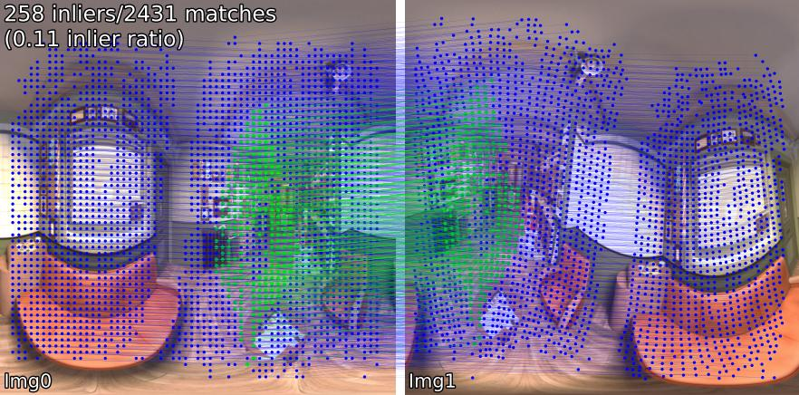
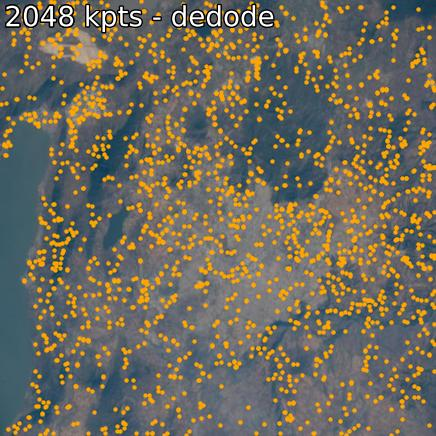
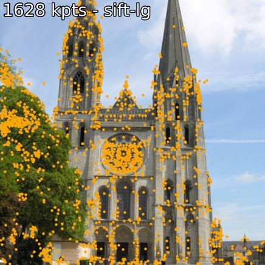
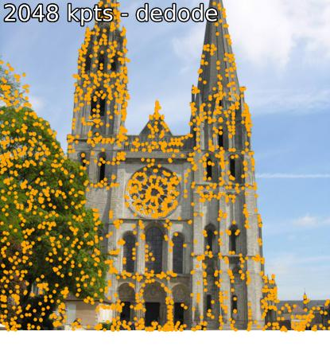

# Image Matching Models (IMM)

A unified API for quickly and easily trying 29 (and growing!) image matching models.

[](https://colab.research.google.com/github/alexstoken/image-matching-models/blob/main/demo.ipynb)

Jump to: [Install](#install) | [Use](#use) | [Models](#available-models) | [Add a Model/Contributing](#adding-a-new-method) | [Acknowledgements](#acknowledgements) | [Cite](#cite)

### Matching Examples
Compare matching models across various scenes. For example, we show `SIFT-LightGlue` and `LoFTR` matches on pairs: 
<p>(1) outdoor, (2) indoor, (3) satellite remote sensing, (4) paintings, (5) a false positive, and (6) spherical. </p>
<details open><summary>
SIFT-LightGlue
</summary>
<p float="left">
  
  
  
  
  
    

</p>
</details>

<details open><summary>
LoFTR
</summary>
<p float="left">
  
  
  
  
  
  
</p>
</details>

### Extraction Examples
You can also extract keypoints and associated descriptors. 
<details open><summary>
SIFT and DeDoDe
</summary>
<p float="left">
  
  
  
  
</p>
</details>

## Install
### From Source [Recommended]
If you want to to install from source (easiest to edit, use `benchmark.py`, `demo.ipynb`), 
```bash
git clone --recursive https://github.com/alexstoken/image-matching-models
cd image-matching-models
pip install .
```
Some models (`omniglue`, LoFTR family) require one-off dependencies (`tensorflow`, `pytorch-lightning`), which are not included in the default list. To install these, use 
```
pip install .[all]
```
This will install all dependencies needed to run all models.

We recommend using torch>=2.2, we didn't test most models with older versions.

### As package (simplest)
You can install directly to your package directory with 
```bash
pip install git+https://github.com/alexstoken/image-matching-models.git
```
Similar to the above, to get all optional dependencies, use the `[all]` addendum:
```bash
pip install "image-matching-models[all] @ git+https://github.com/alexstoken/image-matching-models.git"
```

> [!Note]  
> SphereGlue depends on `torch-geometric` and `torch-cluster` which require that you pass an additional parameter given your installed versions of torch and CUDA like so: `pip install .[all] -f https://data.pyg.org/whl/torch-2.5.0+cu124.html` (replace `cu124` with `cpu` for CPU version). See [PyTorch Geometric installation docs](https://pytorch-geometric.readthedocs.io/en/latest/install/installation.html) for more information 


## Use

You can use any of the matchers with 

```python
from matching import get_matcher
from matching.viz import plot_matches

device = 'cuda'  # 'cpu'
matcher = get_matcher('superpoint-lg', device=device)  # Choose any of our ~30+ matchers listed below
img_size = 512  # optional

img0 = matcher.load_image('assets/example_pairs/outdoor/montmartre_close.jpg', resize=img_size)
img1 = matcher.load_image('assets/example_pairs/outdoor/montmartre_far.jpg', resize=img_size)

result = matcher(img0, img1)
num_inliers, H, inlier_kpts0, inlier_kpts1 = result['num_inliers'], result['H'], result['inlier_kpts0'], result['inlier_kpts1']
# result.keys() = ['num_inliers', 'H', 'all_kpts0', 'all_kpts1', 'all_desc0', 'all_desc1', 'matched_kpts0', 'matched_kpts1', 'inlier_kpts0', 'inlier_kpts1']
plot_matches(img0, img1, result, save_path='plot_matches.png')
```

You can also run this as a standalone script, which will perform inference on the the examples inside `./assets`. You may also resolution (`im_size`) and number of keypoints (`n_kpts`). This will take a few seconds on a laptop's CPU, and will produce the same images that you see above.

```bash
python main_matcher.py --matcher sift-lg --device cpu --out_dir output_sift-lg
```
where `sift-lg` will use `SIFT + LightGlue`.

The script will generate an image with the matching keypoints for each pair, under `./output_sift-lg`.

### Use on your own images

To use on your images you have three options:
1. create a directory with sub-directories, with two images per sub-directory, just like `./assets/example_pairs`. Then use as `python main_matcher.py --input path/to/dir`
2. create a file with pairs of paths, separate by a space, just like `assets/example_pairs_paths.txt`. Then use as `python main_matcher.py --input path/to/file.txt`
3. import the matcher package into a script/notebook and use from there, as in the example above

### Keypoint Extraction and Description
To extract keypoints and descriptions (when available) from a single image, use the `extract()` method.

```python
from matching import get_matcher

device = 'cuda' # 'cpu'
matcher = get_matcher('superglue', device=device)  # Choose any of our ~30+ matchers listed below
img_size = 512 # optional

img = matcher.load_image('assets/example_pairs/outdoor/montmartre_close.jpg', resize=img_size)

result = matcher.extract(img)
# result.keys() = ['all_kpts0', 'all_desc0']
plot_kpts(img, result)
```

As with matching, you can also run extraction from the command line
```bash
python main_extractor.py --matcher sift-lg --device cpu --out_dir output_sift-lg --n_kpts 2048
```


## Available Models
You can choose any of the following methods (input to `get_matcher()`):

**Dense**: ```roma, tiny-roma, dust3r, mast3r```

**Semi-dense**: ```loftr, eloftr, se2loftr, aspanformer, matchformer, xfeat-star```

**Sparse**: ```[sift, superpoint, disk, aliked, dedode, doghardnet, gim, xfeat]-lg, dedode, steerers, dedode-kornia, [sift, orb, doghardnet]-nn, patch2pix, superglue, r2d2, d2net,  gim-dkm, xfeat, omniglue, [dedode, xfeat, aliked]-subpx, [sift, superpoint]-sphereglue```

> [!TIP]
> You can pass a list of matchers, i.e. `get_matcher([xfeat, tiny-roma])` to run both matchers and concatenate their keypoints. 

All the matchers can run on GPU, and most of them can run both on GPU or CPU. A few can't run on CPU.

## Model Details
> [!IMPORTANT]
> Check the LICENSE of each model/original code base before use in your application. Some are heavily restricted. 

| Model | Code | Paper | GPU Runtime (s/img)| CPU Runtime (s/img) |
|-------|------|-------|----|----|
| Keypt2Subpx* (ECCV '24) | [Official](https://github.com/KimSinjeong/keypt2subpx) | [arxiv](https://arxiv.org/abs/2407.11668)| 0.055 /0.164 / 0.033 / 0.291  | -- |
| MASt3R (ArXiv '24) | [Official](https://github.com/naver/mast3r?tab=readme-ov-file) | [arxiv](https://arxiv.org/abs/2406.09756) | 0.699 | -- |
| Efficient-LoFTR (CVPR '24) | [Official](https://github.com/zju3dv/efficientloftr) | [pdf](https://zju3dv.github.io/efficientloftr/files/EfficientLoFTR.pdf) | 0.1026 | 2.117 |
| OmniGlue (CVPR '24) | [Official](https://github.com/google-research/omniglue) | [arxiv](https://arxiv.org/abs/2405.12979) | ❌ | 6.351 |
| xFeat (CVPR '24) | [Official](https://github.com/verlab/accelerated_features) | [arxiv](https://arxiv.org/abs/2404.19174) | 0.027 | 0.048 | 
| GIM (ICLR '24) | [Official](https://github.com/xuelunshen/gim?tab=readme-ov-file) | [arxiv](https://arxiv.org/abs/2402.11095)  |  0.077 (+LG) /  1.627 (+DKMv3) | 5.321 (+LG) /  20.301 (+DKMv3) |
| RoMa / Tiny-RoMa (CVPR '24) | [Official](https://github.com/Parskatt/RoMa) | [arxiv](https://arxiv.org/abs/2305.15404) |  0.453 / 0.0456 |  18.950 |
| DUSt3R (CVPR '24) | [Official](https://github.com/naver/dust3r) | [arxiv](https://arxiv.org/abs/2312.14132) | 3.639 |  26.813 |
| DeDoDe (3DV '24) | [Official](https://github.com/Parskatt/DeDoDe/tree/main) | [arxiv](https://arxiv.org/abs/2308.08479) |  0.311 (+MNN)/ 0.218 (+LG) | ❌ |
| Steerers (CVPR '24) | [Official](https://github.com/georg-bn/rotation-steerers) | [arxiv](https://arxiv.org/abs/2312.02152) | 0.150 | ❌ |
| SphereGlue* (CVPRW '23) | [Official](https://github.com/vishalsharbidar/SphereGlue) | [pdf](https://openaccess.thecvf.com/content/CVPR2023W/IMW/papers/Gava_SphereGlue_Learning_Keypoint_Matching_on_High_Resolution_Spherical_Images_CVPRW_2023_paper.pdf) | 0.548 / 0.070  | 0.804 / 7.407  |
| LightGlue* (ICCV '23) | [Official](https://github.com/cvg/LightGlue) | [arxiv](https://arxiv.org/abs/2306.13643) | 0.417 / 0.093 / 0.184 / 0.128 | 2.828 / 8.852 / 8.100 / 8.128 |
| SE2-LoFTR (CVPRW '22) | [Official](https://github.com/georg-bn/se2-loftr) | [arxiv](https://arxiv.org/abs/2204.10144) | 0.133 | 2.378 | 
| Aspanformer (ECCV '22) | [Official](https://github.com/apple/ml-aspanformer) | [arxiv](https://arxiv.org/abs/2208.14201) | 0.384 | 11.73 | 
| Matchformer (ACCV '22) | [Official](https://github.com/jamycheung/MatchFormer) | [arxiv](https://arxiv.org/abs/2203.09645) | 0.232 | 6.101 | 
| LoFTR (CVPR '21) | [Official](https://github.com/zju3dv/LoFTR) / [Kornia](https://kornia.readthedocs.io/en/stable/feature.html#kornia.feature.LoFTR) | [arxiv](https://arxiv.org/abs/2104.00680) | 0.722 | 2.36 | 
| Patch2Pix (CVPR '21) | [Official](https://github.com/GrumpyZhou/patch2pix)  / [IMT](https://github.com/GrumpyZhou/image-matching-toolbox) | [arxiv](https://arxiv.org/abs/2012.01909) | 0.145 | 4.97 | 
| SuperGlue (CVPR '20) | [Official](https://github.com/magicleap/SuperGluePretrainedNetwork) / [IMT](https://github.com/GrumpyZhou/image-matching-toolbox/blob/main/immatch/modules/superglue.py) | [arxiv](https://arxiv.org/abs/1911.11763)  | 0.0894 | 2.178 | 
| R2D2 (NeurIPS '19) | [Official](https://github.com/naver/r2d2) / [IMT](https://github.com/GrumpyZhou/image-matching-toolbox/blob/main/immatch/modules/r2d2.py) | [arxiv](https://arxiv.org/abs/1906.06195) | 0.429 | 6.79 | 
| D2Net (CVPR '19) | [Official](https://github.com/mihaidusmanu/d2-net) / [IMT](https://github.com/GrumpyZhou/image-matching-toolbox/blob/main/immatch/modules/d2net.py) | [arxiv](https://arxiv.org/abs/1905.03561) | 0.600 | 1.324 | 
| SIFT-NN (IJCV '04)| [OpenCV](https://docs.opencv.org/4.x/d7/d60/classcv_1_1SIFT.html) | [pdf](https://www.cs.ubc.ca/~lowe/papers/ijcv04.pdf) |0.124 | 0.117 | 
| ORB-NN (ICCV '11)| [OpenCV](https://docs.opencv.org/3.4/db/d95/classcv_1_1ORB.html) | [ResearchGate](https://www.researchgate.net/publication/221111151_ORB_an_efficient_alternative_to_SIFT_or_SURF) |0.088 | 0.092 |
| DoGHardNet (NeurIPS '17) | [IMT](https://github.com/GrumpyZhou/image-matching-toolbox/blob/main/immatch/modules/dogaffnethardnet.py) / [Kornia](https://kornia.readthedocs.io/en/stable/feature.html#kornia.feature.HardNet) | [arxiv](https://arxiv.org/abs/1705.10872v4) | 2.697 (+NN) / 0.526 (+LG) | 2.438(+NN) / 4.528 (+LG) |
<!--| SiLK (ICCV '23) | [Official](https://github.com/facebookresearch/silk) | [arxiv](https://arxiv.org/abs/2304.06194) | 0.694 | 3.733 | -->

Our implementation of Patch2Pix (+ Patch2PixSuperGlue), R2D2, and D2Net are based on the [Image Matching Toolbox](https://github.com/GrumpyZhou/image-matching-toolbox/tree/main) (IMT). LoFTR and DeDoDe-Lightglue are from [Kornia](https://github.com/kornia/kornia). Other models are based on the offical repos above.

Runtime benchmark is the average of 5 iterations over the 5 pairs of examples in the `assets/example_pairs` folder at image size 512x512. Benchmark is done using `benchmark.py` on an NVIDIA RTX A4000 GPU. Results rounded to the hundredths place.

\* `SphereGlue` model runtimes are listed in the order: SIFT, SuperPoint

\* `LightGlue` model runtimes are listed in the order: SIFT, SuperPoint, Disk, ALIKED


\* `Keypt2Subpx` model runtimes are listed in the order: superpoint-lg, aliked-lg, xfeat, dedode
##

### Adding a new method
See [CONTRIBUTING.md](CONTRIBUTING.md) for details. 


    
> [!Note]  
> This repo is optimized usability, but necessarily for speed. The idea is to use this repo to find the matcher that best suits your needs, and then use the original code to get the best out of it.

    
### Acknowledgements
  
Special thanks to the authors of the respective works that are included in this repo (see their papers above). Additional thanks to [@GrumpyZhou](https://github.com/GrumpyZhou) for developing and maintaining the [Image Matching Toolbox](https://github.com/GrumpyZhou/image-matching-toolbox/tree/main), which we have wrapped in this repo, and the [maintainers](https://github.com/kornia/kornia?tab=readme-ov-file#community) of [Kornia](https://github.com/kornia/kornia).


## Cite
This repo was created as part of the EarthMatch paper. Please consider citing EarthMatch work if this repo is helpful to you!

```
@InProceedings{Berton_2024_EarthMatch,
    author    = {Berton, Gabriele and Goletto, Gabriele and Trivigno, Gabriele and Stoken, Alex and Caputo, Barbara and Masone, Carlo},
    title     = {EarthMatch: Iterative Coregistration for Fine-grained Localization of Astronaut Photography},
    booktitle = {Proceedings of the IEEE/CVF Conference on Computer Vision and Pattern Recognition (CVPR) Workshops},
    month     = {June},
    year      = {2024},
}
```
