# vismatch (formerly Image Matching Models)

Vis(ion)Match(ers) is a unified API for quickly and easily trying 50+ (and growing!) image matching models.

<a href="https://colab.research.google.com/github/gmberton/vismatch/blob/main/demo.ipynb">
  
</a>
<a href="https://huggingface.co/vismatch">
  
</a>
<a href="https://gmberton.github.io/vismatch-downloads-tracker/downloads_per_day.html">
  
</a>
<a href="https://pypi.org/project/vismatch/">
  
</a>
<a href="https://pypi.org/project/vismatch/">
  
</a>
<a href="https://gmberton.github.io/vismatch-downloads-tracker/downloads_per_day.html">
  
</a>


Jump to: [Install](#install) | [Use](#use) | [Models](#available-models) | [Add a Model / Contributing](#adding-a-new-method) | [Acknowledgements](#acknowledgements) | [Cite](#cite) | [Download Stats](#download-stats)

### Matching Examples
Compare matching models across various scenes. For example, we show `SIFT-LightGlue` and `LoFTR` matches on pairs: 
<p>(1) outdoor, (2) indoor, (3) satellite remote sensing, (4) paintings, (5) a false positive, and (6) spherical. </p>
<details open><summary>
SIFT-LightGlue
</summary>
<p float="left">
  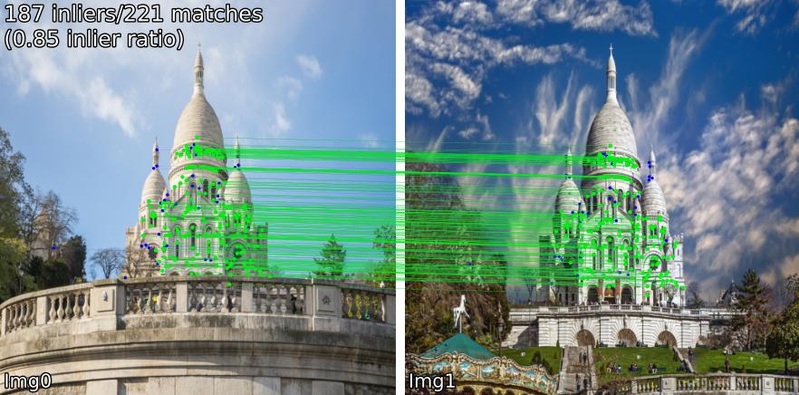
  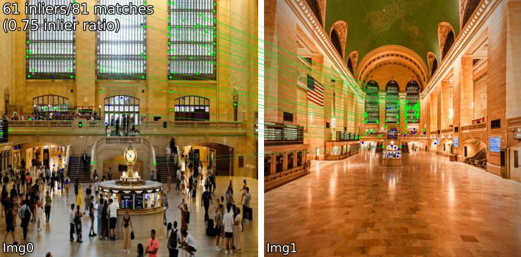
  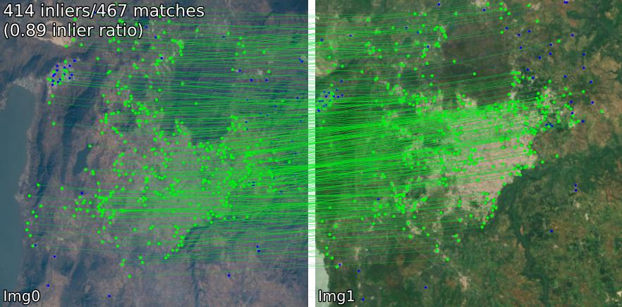
  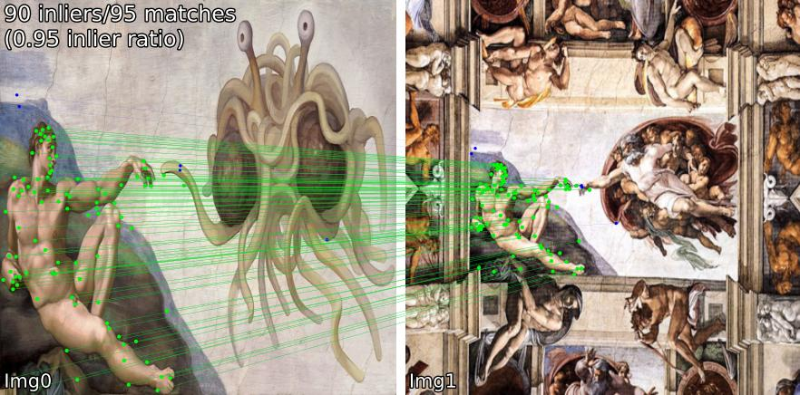
  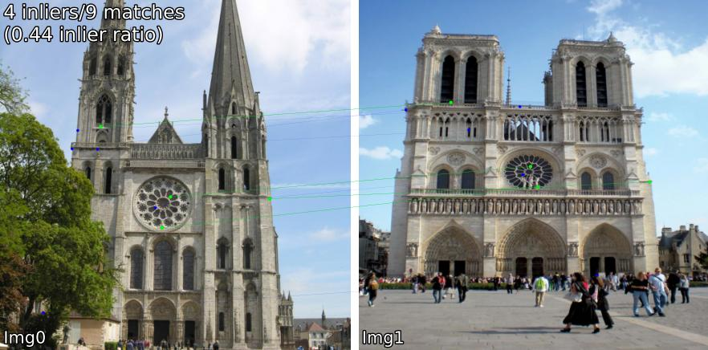
  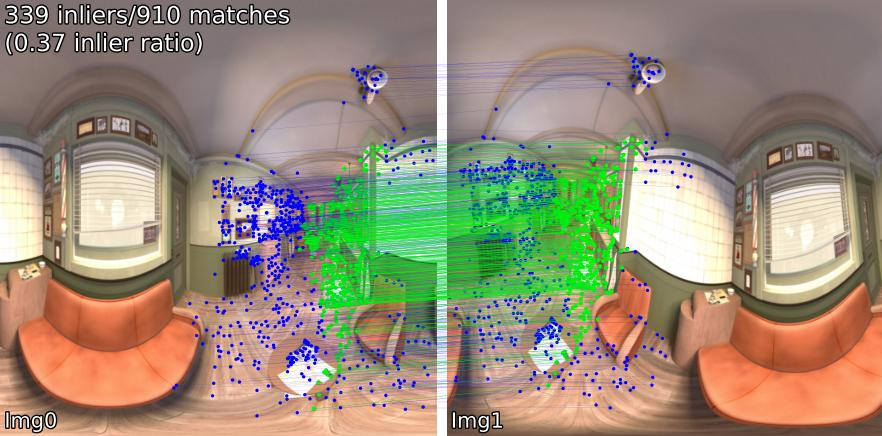

</p>
</details>

<details open><summary>
LoFTR
</summary>
<p float="left">
  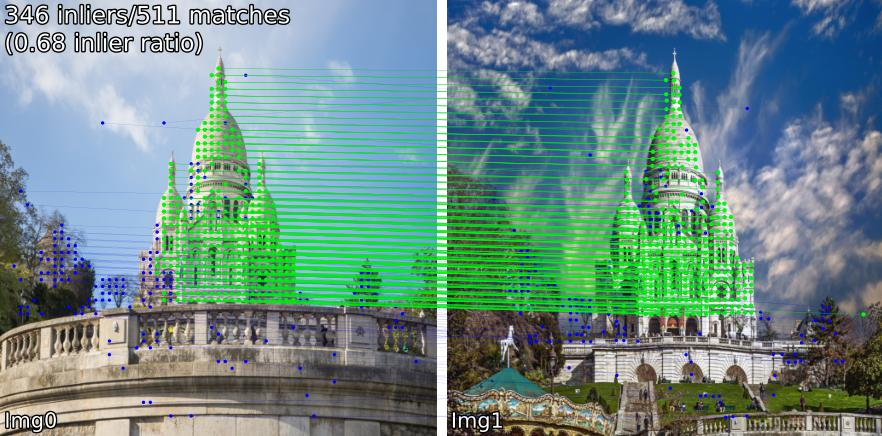
  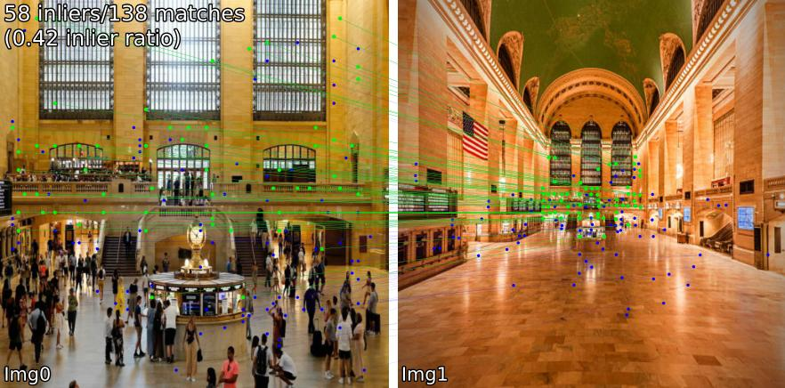
  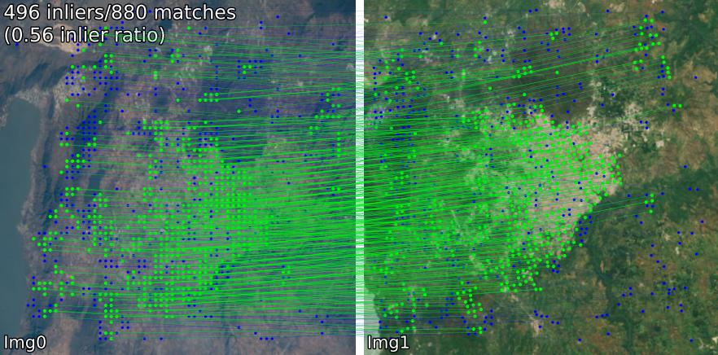
  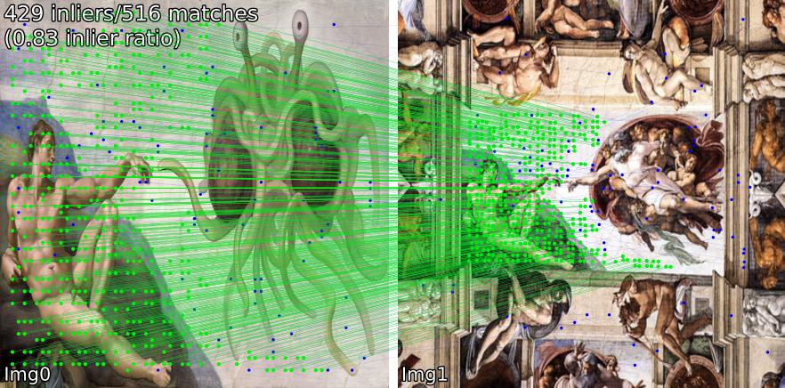
  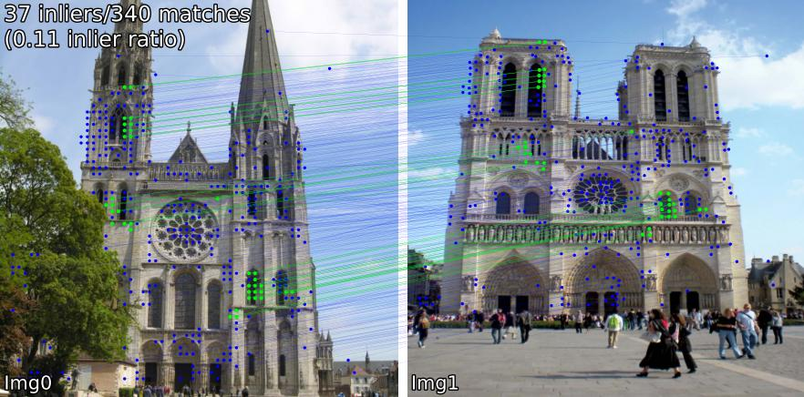
  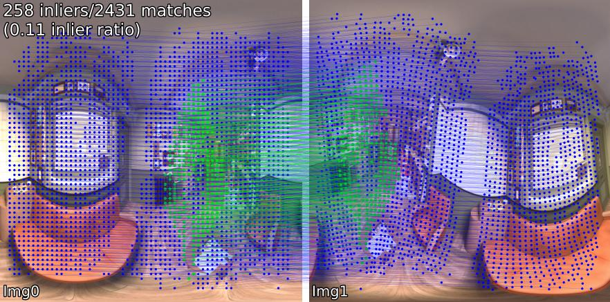
</p>
</details>

### Extraction Examples
You can also extract keypoints and associated descriptors. 
<details open><summary>
SIFT and DeDoDe
</summary>
<p float="left">
  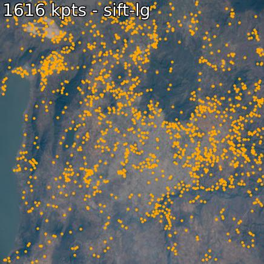
  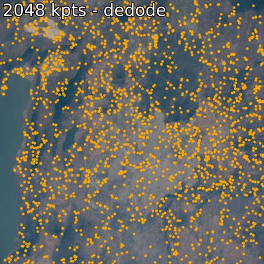
  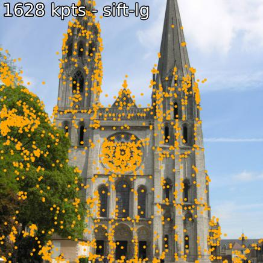
  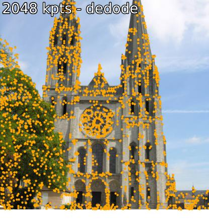
</p>
</details>

## Install
vismatch can be installed directly from PyPi. We strongly recommend using `uv`, but `pip` should work too
```bash
pip install uv             # install uv
uv venv                    # create uv venv
source .venv/bin/activate  # activate uv venv
uv pip install vismatch
# or, if you don't want to use uv
pip install vismatch
```

or, for development, clone this git repo and install with:

```bash
# Clone recursively
git clone --recursive https://github.com/gmberton/vismatch
cd vismatch

uv venv                    # create uv venv
source .venv/bin/activate  # activate uv venv
# editable install for dev work
uv pip install -e . 
# or non-editable install
uv pip install .
```

Some models require additional optional dependencies which are not included in the default list, like torch-geometric (required by SphereGlue) and tensorflow/larq (required by OmniGlue/ZippyPoint). To install these, use
```
uv pip install ".[all]"
# or
pip install .[all]
```


## Use

You can use any of the over 50 matchers simply like this. All model weights are automatically downloaded by vismatch.

### Python API
```python
from vismatch import get_matcher
from vismatch.viz import plot_matches, plot_kpts

# Choose any of the 50+ matchers listed below
matcher = get_matcher("superpoint-lightglue", device="cuda")
img_size = 512  # optional

img0 = matcher.load_image("assets/example_pairs/outdoor/montmartre_close.jpg", resize=img_size)
img1 = matcher.load_image("assets/example_pairs/outdoor/montmartre_far.jpg", resize=img_size)

result = matcher(img0, img1)
# result.keys() = ["num_inliers", "H", "all_kpts0", "all_kpts1", "all_desc0", "all_desc1", "matched_kpts0", "matched_kpts1", "inlier_kpts0", "inlier_kpts1"]

# This will plot visualizations for matches as shown in the figures above
plot_matches(img0, img1, result, save_path="plot_matches.png")

# Or you can extract and visualize keypoints as easily as
result = matcher.extract(img0)
# result.keys() = ["all_kpts0", "all_desc0"]
plot_kpts(img0, result, save_path="plot_kpts.png")
```

### Command Line Interface / Standalone Scripts
You can also run matching or extraction as standalone scripts, to get the same results as above. 
#### Matching:
```bash
# if you cloned this repo, vismatch_match.py is available, else see CLI below
python vismatch_match.py --matcher superpoint-lightglue --out-dir outputs/superpoint-lightglue --input assets/example_pairs/outdoor/montmartre_close.jpg assets/example_pairs/outdoor/montmartre_far.jpg
# or
uv run vismatch_match.py --matcher superpoint-lightglue --out-dir outputs/superpoint-lightglue --input assets/example_pairs/outdoor/montmartre_close.jpg assets/example_pairs/outdoor/montmartre_far.jpg
```
From any location where an python enviroment with vismatch installed is active, you can also run
```bash
# for PyPi install, use CLI entry point
vismatch-match --matcher superpoint-lightglue --out-dir outputs/superpoint-lightglue --input path/to/img0 --input path/to/img2
```
#### Keypoints extraction:
```bash
# if you cloned this repo, vismatch_extract.py is available, else see CLI below
python vismatch_extract.py --matcher superpoint-lightglue --out-dir outputs/superpoint-lightglue --input assets/example_pairs/outdoor/montmartre_close.jpg
# or
uv run vismatch_extract.py --matcher superpoint-lightglue --out-dir outputs/superpoint-lightglue --input assets/example_pairs/outdoor/montmartre_close.jpg
```
From any location where an python enviroment with vismatch installed is active, you can also run

```bash
# for PyPi install, use CLI entry point
vismatch-extract --matcher superpoint-lightglue --out-dir outputs/superpoint-lightglue --input path/to/img0
```

These scripts can take as input images, folders with multiple images (or multiple pairs of images), or files with pairs of images paths.
To see all possible parameters run
```bash
python vismatch_match.py -h
# or
python vismatch_extract.py -h
```


## Available Models
We support the following methods:

**Dense**: ```roma, tiny-roma, duster, master, minima-roma, ufm```

**Semi-dense**: ```loftr, eloftr, se2loftr, xoftr, minima-loftr, aspanformer, matchformer, xfeat-star, xfeat-star-steerers[-perm/-learned], edm, rdd-star, topicfm[-plus]```

**Sparse**: ```[sift, superpoint, disk, aliked, dedode, doghardnet, gim, xfeat]-lightglue, dedode, steerers, affine-steerers, xfeat-steerers[-perm/learned], dedode-kornia, [sift, orb, doghardnet]-nn, patch2pix, superglue, r2d2, d2net,  gim-dkm, xfeat, omniglue, [dedode, xfeat, aliked]-subpx, [sift, superpoint]-sphereglue, minima-superpoint-lightglue, liftfeat, rdd-[sparse,lightglue, aliked], ripe, lisrd, zippypoint```

See [Model Details](docs/model_details.md) to see runtimes, supported devices, and source of each model.

## Adding a new method
See [CONTRIBUTING.md](CONTRIBUTING.md) for details. We follow the [1st principle of PyTorch](https://docs.pytorch.org/docs/stable/community/design.html#design-principles): Usability over Performance

## Acknowledgements
Special thanks to the authors of all models included in this repo (links in [Model Details](docs/model_details.md)), and to authors of other libraries we wrap like the [Image Matching Toolbox](https://github.com/GrumpyZhou/image-matching-toolbox/tree/main) and [Kornia](https://github.com/kornia/kornia).

## Download Stats
Daily downloads across all [vismatch HuggingFace models](https://huggingface.co/vismatch), updated daily.
Click the plot for the interactive version.

<a href="https://gmberton.github.io/vismatch-downloads-tracker/downloads_per_day.html">
  
</a>

## Cite
This repo was created as part of the EarthMatch paper. Please cite EarthMatch if this repo is helpful to you!

```
@InProceedings{Berton_2024_EarthMatch,
    author    = {Berton, Gabriele and Goletto, Gabriele and Trivigno, Gabriele and Stoken, Alex and Caputo, Barbara and Masone, Carlo},
    title     = {EarthMatch: Iterative Coregistration for Fine-grained Localization of Astronaut Photography},
    booktitle = {Proceedings of the IEEE/CVF Conference on Computer Vision and Pattern Recognition (CVPR) Workshops},
    month     = {June},
    year      = {2024},
}
```
